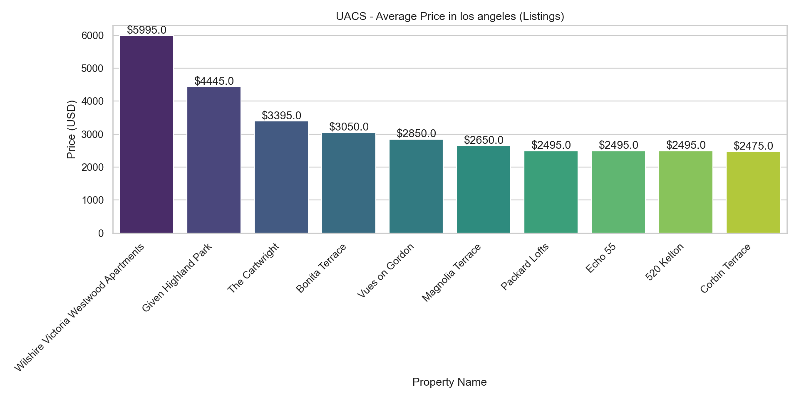
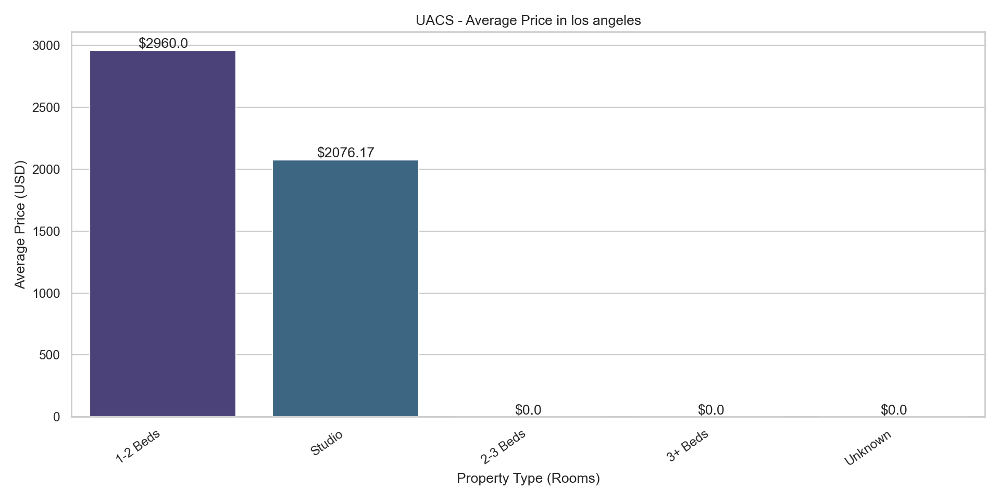
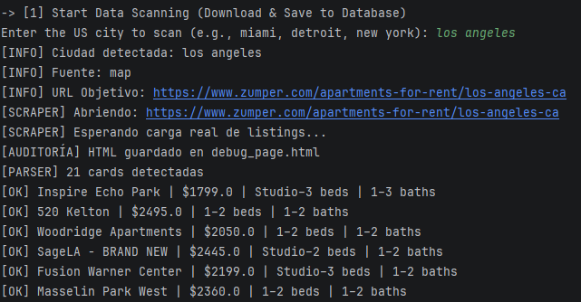
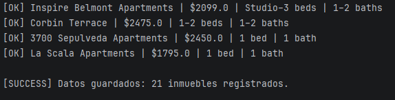
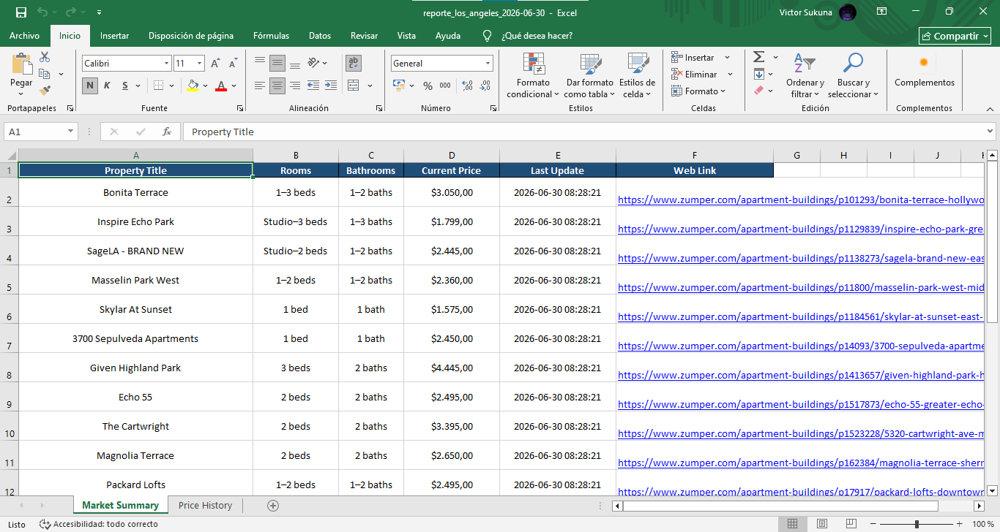
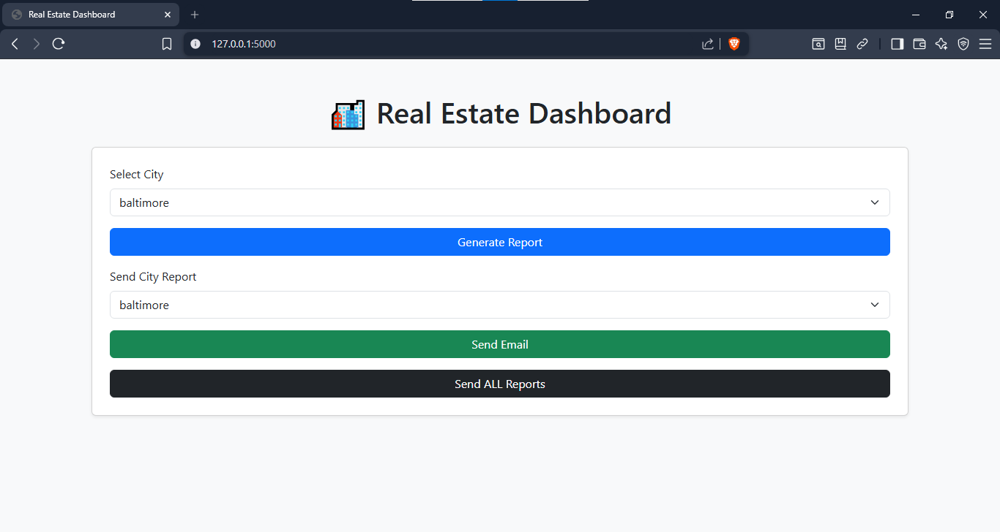

# 🏠 Real Estate Scraper Pro

[🇺🇸 English](#-english-version) | [🇪🇸 Español](#-versión-en-español)

---

# 🇺🇸 English Version

## 🚀 Overview

**Real Estate Scraper Pro** is a professional Python system for **real estate data scraping, analysis, reporting, and visualization**.

It automates data extraction, stores it in a structured database, generates reports, and provides a web dashboard for interaction.

---

## ✨ Features

* 🔎 Web scraping (Zumper)
* 🗄️ SQLite database
* 📊 Excel reports with historical tracking
* 📈 Chart generation (PNG)
* 📧 Email automation (TLS)
* 🧹 Data cleanup tools
* 🌐 Flask dashboard
* 🧩 Modular architecture

---

## 🏗️ System Architecture

| Component | Responsibility                              |
| --------- | ------------------------------------------- |
| `main.py` | Data processing, scraping, reports, cleanup |
| `app.py`  | Visualization and report interaction        |

---

## 🔄 Workflow (Real Usage)

### Step 1 — Run Core System

```bash
python main.py
```

* Select language (EN/ES)
* Choose option **[1] Scan Data**
* Enter a city (miami, tampa, etc.)

👉 System will:

* Scrape data (Selenium)
* Parse HTML (BeautifulSoup)
* Store data in SQLite

---

### Step 2 — Generate Reports

Select:

```
[2] Generate Reports
```

👉 System generates:

* Excel file
* Market chart (PNG)
* Listings chart (PNG)

---

### Step 3 — Send Reports (Optional)

* `[5]` → Send report for ONE city
* `[6]` → Send ALL reports

---

## 🧠 CLI Menu

```
[1] Scan Data → Scrape and store listings  
[2] Generate Reports → Excel + charts  
[3] Clean Files → Delete generated files  
[4] Clear Database → Delete all data  
[5] Send Email → One city  
[6] Send All → All reports  
[0] Exit  
```

⚠️ Important:

* Run **[1] before [2]**
* If reports don’t exist → email will fail

---

## 📸 Screenshots

### 📊 Charts

**Detailed Listings Chart**


**Grouped Beds Chart**


---

### 🖥️ Console Execution

**Scraping Process**


**Successful Results**


---

### 📄 Excel Report



---

### 🌐 Web Dashboard



---

## 📄 Excel Reports

### `Daily Results`

* Current scraping data
* Detailed information

### `Historical Data`

* Full history
* Tracks price changes

⚠️ Logic:

* No UPDATE
* Only INSERT

---

## 📧 Email Configuration

```env
EMAIL_USER=
EMAIL_PASSWORD=
EMAIL_RECEIVER=
SMTP_SERVER=smtp.gmail.com
SMTP_PORT=587
```

---

## ⚙️ Installation

```bash
git clone https://github.com/victor-veira-py/real-estate-scraper-pro.git
cd real-estate-scraper-pro
python -m venv venv
venv\Scripts\activate
pip install -r requirements.txt
python main.py
```

---

## 🌐 Run Dashboard

```bash
python app.py
```

Open:

```
http://127.0.0.1:5000/
```

---

## 🛠️ Technologies

* Python
* Selenium
* BeautifulSoup
* SQLite
* Pandas
* Matplotlib
* Flask
* python-dotenv

---

## 👨‍💻 Author

Víctor Armando De Oliveira Rodríguez

---

## 📌 License

MIT License

---

# 🇪🇸 Versión en Español

## 🚀 Descripción

**Real Estate Scraper Pro** es un sistema profesional en Python para **scraping, análisis, reportes y visualización de datos inmobiliarios**.

---

## ✨ Funcionalidades

* 🔎 Scraping desde Zumper
* 🗄️ Base de datos SQLite
* 📊 Excel con historial
* 📈 Gráficos PNG
* 📧 Envío de correos (TLS)
* 🧹 Limpieza de datos
* 🌐 Dashboard Flask

---

## 🏗️ Arquitectura

| Componente | Función                           |
| ---------- | --------------------------------- |
| `main.py`  | Scraping, procesamiento, reportes |
| `app.py`   | Visualización                     |

---

## 🔄 Flujo REAL

### Paso 1 — Ejecutar sistema

```bash
python main.py
```

* Elegir idioma
* Opción **[1] Escanear**
* Ingresar ciudad

---

### Paso 2 — Generar reportes

```
[2] Generar Reportes
```

Genera:

* Excel
* Gráficos

---

### Paso 3 — Enviar (Opcional)

* `[5]` → Una ciudad
* `[6]` → Todas

---

## 🧠 Menú

```
[1] Escanear  
[2] Reportes  
[3] Limpiar archivos  
[4] Vaciar DB  
[5] Enviar uno  
[6] Enviar todo  
[0] Salir  
```

⚠️ Importante:

* Ejecutar [1] antes de [2]

---

## 📸 Capturas

### 📊 Gráficos


---

### 🖥️ Consola


---

### 📄 Excel


---

### 🌐 Dashboard


---

## 📄 Excel

* `Daily Results` → Datos del día
* `Historical Data` → Historial completo

⚠️ Solo INSERT (no UPDATE)

---

## ⚙️ Instalación

```bash
git clone https://github.com/victor-veira-py/real-estate-scraper-pro.git
cd real-estate-scraper-pro
python -m venv venv
venv\Scripts\activate
pip install -r requirements.txt
python main.py
```

---

## 💯 Autor

Víctor Armando De Oliveira Rodríguez

---

## 📌 Licencia

MIT
